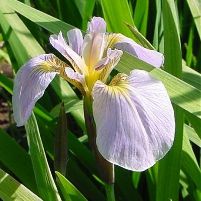

<style>
.reveal h3 { 
  font-size: 40px;
  color: black;
}
.reveal .slides section .slideContent h2 {
   font-size: 20px;
   font-weight: bold;
   color: green;
}
.reveal ul, 
.reveal ol {
    font-size: 20px;
    color: blue;
    list-style-type: circle;
}

.reveal h1 { 
  font-size: 0.9em; 
}

.reveal h1,
.reveal h2,
.reveal h3,
.reveal h4,
.reveal h5,
.reveal h6 { 
   margin-bottom: .3em;    
}
.reveal small {
	font-size: 0.85em;
}
.reveal section img {
   border: none;
   height:50px; 
   width:50px;
}
.reveal pre code {
  display: block; padding: 0.5em;
  font-size: 0.9em;
  line-height: 1.0em;
  background-color: white;
  overflow: visible;
  max-height: none;
  word-wrap: normal;
}
.reveal code {
  overflow: visible;
  max-height: none;
}

.reveal code.r {
  background-color: #F8F8F8;
}
</style>
Irisshinyapp : Data Product for Linear Descriminant Analysis
========================================================
author: UshaKiran.Kota
date: Aug-22-2015
autosize: true
transition: rotate
transition-speed:slow
font-family:'Helvetica'

Iris Data set : Notes
========================================================

<style>
.reveal ul, 
.reveal ol {
    font-size: 20px;
    color: blue;
    list-style-type: square;
}


</style>
A few lines about Iris Data set and the species images :

- <small>Iris data set is popular data set collected by Anderson and published in "The irises of the Gaspe Peninsula", and which originally inspired Fisher to develop Linear Descriminant Analysis Technique</small>
- <small>Anderson collected and measured hundreds of irises in an
effort to study variation between and among the dierent
species</small>
- <small>There are 260 species of iris; this data set focuses of three of them (Iris setosa,Iris virginica,and Iris versicolor)</small>
- <small>Four features were measured on 50 samples for each species:
sepal width, sepal length, petal width, and petal length</small>

***
<style>
.reveal section img {
   border: none;
   height:50px; 
   width:50px;
}
</style>




Irisshinyapp: Data Analysis Features
========================================================
<style>
.reveal ul, 
.reveal ol {
    font-size: 20px;
    color: blue;
    list-style-type: square;
}

.reveal section img {
   border: none;
   height:400px; 
   width:600px;
}
</style>
Salient Features of Irisshinyapp 

- <small>Irisshinyapp is a sample dataproduct that demonstrates the Technique of Linear Descriminant Analysis</small>
- <small>The data product is developed as a tabbed application </small>
- <small>The saliet features of the application are:</small>
- <small>The ability to display Facts about the LDA on a specific Iris species</small>
- <small>The exploratory visualization with an option to select and analyse each plot</small>
- <small>visualize LDA performance and ability to choose to get the sample statistics</small>


Irisshinyapp : Exploratory Views
========================================================

  
Irisshinyapp : LDA components
========================================================
 

```
[1] "Classifiers"
```

```
[1] setosa setosa setosa setosa setosa setosa
Levels: setosa versicolor virginica
```

```
[1] "posterior probabilities"
```

```
  setosa   versicolor    virginica
1      1 3.896358e-22 2.611168e-42
2      1 7.217970e-18 5.042143e-37
3      1 1.463849e-19 4.675932e-39
```

```
[1] "LD Projections"
```

```
       LD1        LD2
1 8.061800  0.3004206
2 7.128688 -0.7866604
3 7.489828 -0.2653845
```
